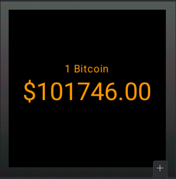

# BitNow

Este projeto consome uma API externa de criptomoedas para exibir o preço atualizado do Bitcoin (BTC) em tempo real.
A aplicação realiza requisições automáticas e periódicas à API CoinGecko e apresenta o valor atual em dólares americanos (USD).

|  |  |
|--------------------|------------------------|
